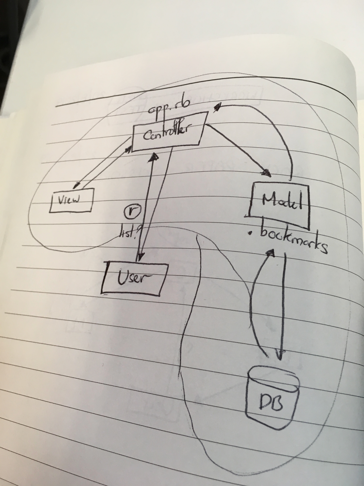

Building webapp to manage bookmarks

USER STORIES

(1) As a user
so I can visit the webapp and see the bookmark
I can view the lists of bookmarks

#For each environment, we will have our own database.

The production database will contain 'real' data. For instance: Facebook's production environment contains real-life users, posts, comments, likes, and so on.
The test database will contain no data. This way, we can set up whatever data we need right before we run our tests.
The development database will initially contain no data. If we run our application locally, we can add data to it.
To set up a test database, let's run psql and create a database, and use the SQL query saved in db/migrations/01_create_bookmarks_table.sql to create a bookmarks table.

$> psql
admin=# CREATE DATABASE "bookmark_manager_test";
admin=# CREATE TABLE bookmarks(id SERIAL PRIMARY KEY, url VARCHAR(60));
Now, if we list databases (in psql or by looking in TablePlus), we'll see two databases for our application: bookmark_manager, and the new bookmark_manager_test database.

(2) As a bookmark manager
So I can manage my bookmarks
I can add new bookmarks in the list 
